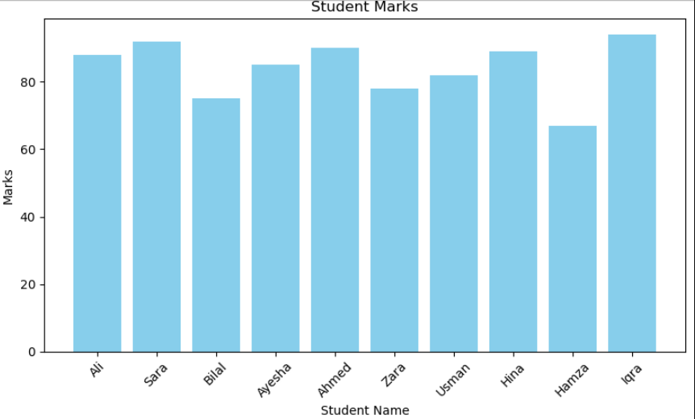
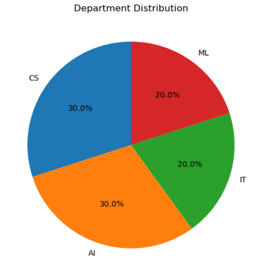
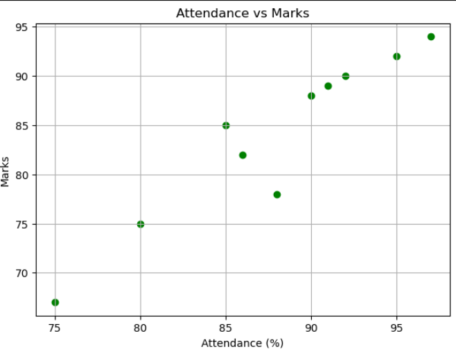
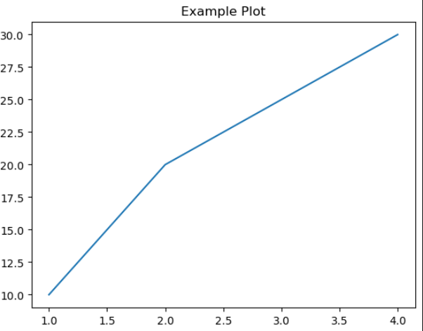

# Student_Marks _Analyzer

 This project analyzes student academic performance using **Python**, **Pandas**, and **Matplotlib**. It demonstrates **data handling, statistical analysis, and visualization** on a small, realistic dataset of students. This project is ideal for beginners in **Data Analysis** and for showcasing a professional portfolio for freelancing.
## 🚀 Features

- Load and explore student dataset containing:
  - Name  
  - Age  
  - Department  
  - Marks  
  - Attendance
- Compute key statistics:
  - Average, maximum, and minimum marks  
  - Department-wise performance
- Visualizations:
  - **Bar chart**: Marks vs Student Names  
  - **Pie chart**: Department distribution  
  - **Scatter plot**: Attendance vs Marks  
  - **Scatter plot with trend line**: Correlation between attendance and marks

## 🧰 Technologies Used

- Python  
- Pandas  
- Matplotlib

- ![project Screenshot]

